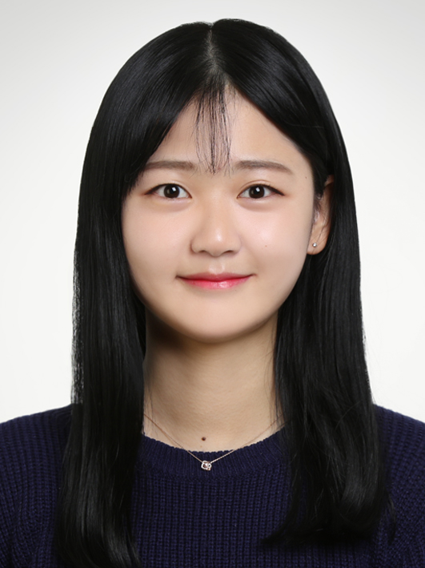

Hello. I am Sugyeong Eo. I am a Ph.D candidate in computer science and engineering at Korea University. I belong to the Natural Language Processing & Artificial Intelligence Lab (NLP&AI Lab), and my advisor is Prof. Heuiseok Lim. Feel free to contact me (below icon can link you and me!).

반갑습니다, 저는 어수경입니다! 현재 고려대학교 석박 통합과정으로 있으며 임희석 교수님의 NLP&AI 연구실에서 연구중에 있습니다. 궁금하신 점이 있을 경우 아래 아이콘을 통해 연락하실 수 있습니다.

 <!-- This is a jekyll based resume template. You can find the full source code on [GitHub] --> 
 <!-- (https://github.com/bk2dcradle/researcher) -->

## Research Interest
Natural Language Processing, Neural Machine Translation, Quality Estimation, Critical Error Detection, Question-Answer pair Generation (Question Generation), Curriculum Learning, Subword Tokenization, Language Modeling.

## Professional Experience
2020.09 - : Graduate, Major in Computer Science and Engineering at Korea University  
2016.02 - 2020.08: Undergraduate, Received Bachelor of Arts and Language Science degree from Hankuk University of Foreign Studies (HUFS)  

## Publications
### Top Conference (Main)
1. [QUAK: A Synthetic Quality Estimation Dataset for Korean-English Neural Machine Translation](https://aclanthology.org/2022.coling-1.460.pdf)  
**Sugyeong Eo**, Chanjun Park, Hyeonseok Moon, Jaehyung Seo, Gyeongmin Kim, Jungseob Lee, Heuiseok Lim
*COLING 2022* 

2. [A Dog Is Passing Over The Jet? A Text-Generation Dataset for Korean Commonsense Reasoning and Evaluation](https://aclanthology.org/2022.findings-naacl.172/)  
Jaehyung Seo, Seounghoon Lee, Chanjun Park, Yoonna Jang, Hyeonseok Moon, **Sugyeong Eo**, Seonmin Koo, Heuiseok Lim  
*NAACL 2022 - Findings* 

3. [Priming Ancient Korean Neural Machine Translation](http://www.lrec-conf.org/proceedings/lrec2022/pdf/2022.lrec-1.3.pdf)  
Chanjun Park, Seolhwa Lee, Hyeonseok Moon, **Sugyeong Eo**, Jaehyung Seo, Heuiseok Lim  
*LREC 2022, 2022* 

4. [Empirical Analysis of Synthetic Data Generation Using Noising Strategies for Automatic Post-editing](https://aclanthology.org/2022.lrec-1.93/)  
Hyeonseok Moon, Chanjun Park, Seolhwa Lee, Jaehyung Seo, Jeongsub Lee, **Sugyeong Eo**, Heuiseok Lim  
*LREC 2022, 2022* 

### Top Conference (Workshop)
1. KU X Upstage's submission for the WMT22 Quality Estimation: Critical Error Detection Shared Task (Will Be Published)
**Sugyeong Eo**, Chanjun Park, Hyeonseok Moon, Jaehyung Seo, Heuiseok Lim
*EMNLP 2022 - Workshop on Machine Translation (WMT) 2022* 

2. [A Self-Supervised Automatic Post-Editing Data Generation Tool](https://arxiv.org/abs/2111.12284)  
Hyeonseok Moon, Chanjun Park, **Sugyeong Eo**, Jaehyung Seo, Seungjun Lee, Heuiseok Lim
*ICML 2022 – DataPerf workshop, 2022* 

3. [How should human translation coexist with NMT? Efficient tool for building high quality parallel corpus](https://arxiv.org/abs/2111.00191)  
Chanjun Park, Seolhwa Lee, Hyeonseok Moon, **Sugyeong Eo**, Jaehyung Seo, Heuiseok Lim  
*NeurIPS 2021 - Data-centric AI (DCAI) workshop, 2021* 

4. [A New Tool for Efficiently Generating Quality Estimation Datasets](https://arxiv.org/abs/2111.00767)  
**Sugyeong Eo**, Chanjun Park, Jaehyung Seo, Hyeonseok Moon, Heuiseok Lim  
*NeurIPS 2021 - Data-centric AI (DCAI) workshop, 2021* 

5. [Automatic Knowledge Augmentation for Generative Commonsense Reasoning](https://arxiv.org/abs/2111.00192)  
Jaehyung Seo, Chanjun Park, **Sugyeong Eo**, Hyeonseok Moon, Heuiseok Lim  
*NeurIPS 2021 - Data-centric AI (DCAI) workshop, 2021* 

6. [BTS: Back TranScription for Speech-to-Text Post-Processor using Text-to-Speech-to-Text](https://aclanthology.org/2021.wat-1.10/) 
Chanjun Park, Jaehyung Seo, Seolhwa Lee, Chanhee Lee, Hyeonseok Moon, **Sugyeong Eo**, Heuiseok Lim 
*ACL 2021 -WAT(Workshop on Asian Translation) 2021 Workshop, 2021 - (oral presentation)* 

7. [Dealing with the Paradox of Quality Estimation](https://aclanthology.org/2021.mtsummit-LoResMT.1/)  
**Sugyeong Eo**, Chanjun Park, Jaehyung Seo, Hyeonseok Moon, Heuiseok Lim **(Equal Contribution(First Co-Author))**  
*MT Summit 2021 - LoResMT, 2021 - (Oral presentation)* 

8. [Should we find another model?: Improving Neural Machine Translation Performance with ONE-Piece Tokenization Method without Model Modification](https://aclanthology.org/2021.naacl-industry.13/) 
Chanjun Park, **Sugyeong Eo**, Hyeonseok Moon, Heuiseok Lim 
*NAACL-HLT 2021 Industry Track, 2021- (Poster/Oral presentation)* 

### International Journal (SCI/SCIE)
1. [Word-level Quality Estimation for Korean-English Neural Machine Translation](https://ieeexplore.ieee.org/document/9761258)  
**Sugyeong Eo**, Chanjun Park, Hyeonseok Moon, Jaehyung Seo, Heuiseok Lim **(Equal Contribution(First Co-Author))**  
*IEEE Access, 2022* 

2. [Dense-to-Question and Sparse-to-Answer: Hybrid Retriever System for Industrial Frequently Asked Questions](https://www.mdpi.com/2227-7390/10/8/1335)  
Jaehyung Seo, Taemin Lee, Hyeonseok Moon, Chanjun Park, **Sugyeong Eo**, Imatitikua D AIyanyo, Kinam Park, Aram So, Sungmin Ahn, Jeongbae Park  
*Mathematics, 2022*  

3. [Mimicking Infants’ Bilingual Language Acquisition for Domain Specialized Neural Machine Translation](https://ieeexplore.ieee.org/document/9751075) 
Chanjun Park, Woo-Young Go, **Sugyeong Eo**, Hyeonseok Moon, Seolhwa Lee, Heuiseok Lim  
*IEEE Access, 2022* 

4. [An Automatic Post Editing with Efficient and Simple Data Generation Method](https://ieeexplore.ieee.org/document/9714400) 
Hyeonseok Moon, Chanjun Park, Jaehyung Seo, **Sugyeong Eo**, Heuiseok Lim **(Equal Contribution(First Co-Author))**  
*IEEE Access, 2022* 

5. [Empirical Analysis of Korean Public AI Hub Parallel Corpora and in-depth Analysis using LIWC](https://arxiv.org/abs/2110.15023)  
Chanjun Park, Midan Shim, **Sugyeong Eo**, Seolhwa Lee, Jaehyung Seo, Hyeonseok Moon, Heuiseok Lim  
*arxiv, 2021* 

6. [An Empirical Study on Automatic Post Editing for Neural Machine Translation](https://ieeexplore.ieee.org/document/9528385)  
Hyeonseok Moon, Chanjun Park, **Sugyeong Eo**, Jaehyung Seo, Heuiseok Lim **(Equal Contribution(First Co-Author))**  
*IEEE Access, 2021* 

7. [Comparative Analysis of Current Approaches to Quality Estimation for Neural Machine Translation](https://www.mdpi.com/2076-3417/11/14/6584) 
**Sugyeong Eo**, Chanjun Park, Hyeonseok Moon, Jaehyung Seo, Heuiseok Lim **(Equal Contribution(First Co-Author))**  
*Applied Sciences, 2021* 

### Domestic Conference & Journal
#### (Only 1st author, further papers can be found in my Google Scholar)
1. [Best Paper(우수논문)] KoCED: 윤리 및 사회적 문제를 초래하는 기계번역 오류 탐지를 위한 학습 데이터셋 (KoCED: English-Korean Critical Error Detection Dataset) (Will Be Published)  
**Sugyeong Eo**, Suwon Choi, Seonmin Koo, Dahyun Jung, Chanjun Park, Jaehyung Seo, Hyeonseok Moon, Jeongbae Park, Heuiseok Lim  
*Annual Conference on Human & Cognitive Language Technology, 2022*  

2. [Zero-Shot 기반 기계번역 품질 예측 연구](https://www.kci.go.kr/kciportal/ci/sereArticleSearch/ciSereArtiView.kci?sereArticleSearchBean.artiId=ART002777668) (Study on Zero-shot based Quality Estimation)  
**Sugyeong Eo**, Chanjun Park, Jaehyung Seo, Hyeonseok Moon, Heuiseok Lim  
*Journal of the Korea Convergence Society, 2021*  

3. [최신 기계번역 품질 예측 연구](https://koreascience.kr/article/JAKO202123162176745.page) (Research on Recent Quality Estimation)  
**Sugyeong Eo**, Chanjun Park, Hyeonseok Moon, Jaehyung Seo, Heuiseok Lim  
*Journal of the Korea Convergence Society, 2021*

4. [한국어 인공신경망 기계번역의 서브 워드 분절 연구 및 음절 기반 종성 분리 토큰화 제안](https://www.kci.go.kr/kciportal/ci/sereArticleSearch/ciSereArtiView.kci?sereArticleSearchBean.artiId=ART002696269) (Research on Subword Tokenization of Korean Neural Machine Translation and Proposal for Tokenization Method to Separate Jongsung from Syllables)  
**Sugyeong Eo**, Chanjun Park, Hyeonseok Moon, Heuiseok Lim  
*Journal of the Korea Convergence Society, 2021*  

### Domestic Patents
1. DEVICE AND METHOD FOR GENERATING OF TRAINING DATA FOR QUALITY ESTIMATION IN MACHINE TRANSLATION  
HeuiSeok Lim, **Sugyeong Eo**, Chanjun Park, Hyeonseok Moon  

3. DEVICE AND METHOD FOR GENERATING TRAINING DATA FOR AUTOMATIC POST EDITING  
HeuiSeok Lim, Hyeonseok Moon, Chanjun Park, **Sugyeong Eo**  

   
